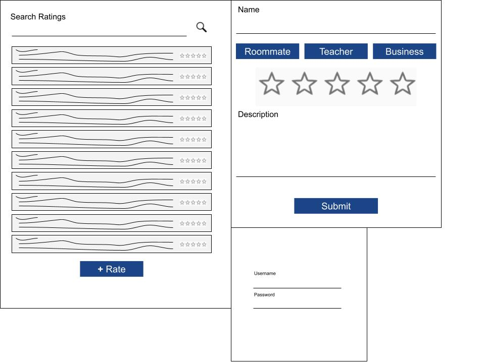
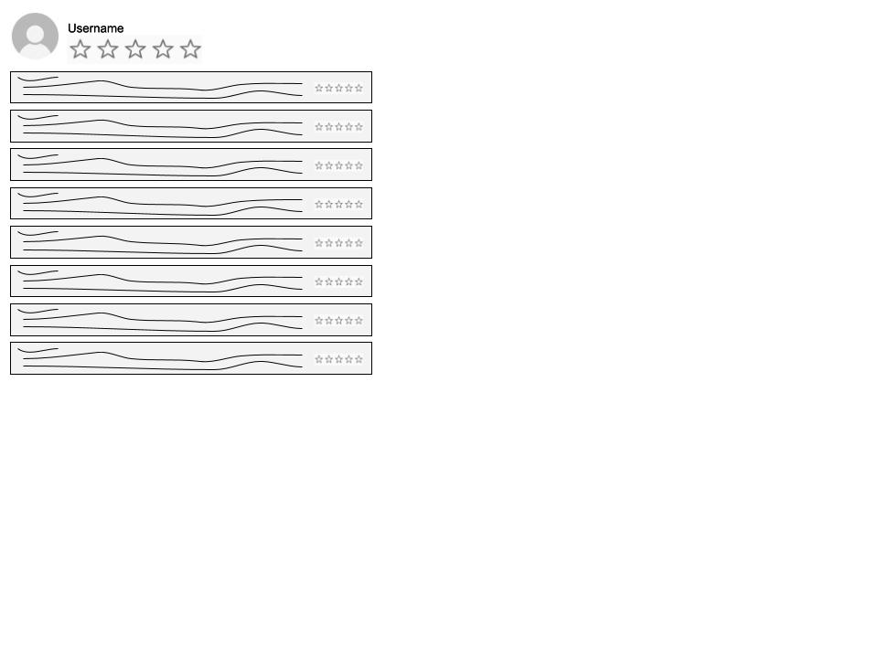
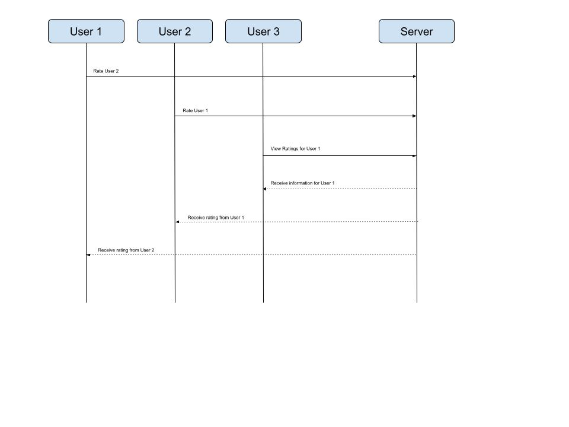

# Rating

## Specification Deliverable

### Elevator Pitch

All across the country countless college students get into dorms and sign up for professors and go to businesses around the area, all things that come with starting or continuing college. However, the problem is that these college students do not know the quality of these roommates, teachers, or businesses. this rating application will allow the student to keep their user login safe and will also allow the user to view ratings from other users on experiences they have had with roommates, professors, or businesses that the current user may need information on. Furthermore, the student will be able add their own ratings to help out their fellow users. The application will help these new college students know what they are walking into before hand and equip them with the knowledge they need to make all preparations accordingly, knowing the history of these professors, businesses, and roommates.

### Design

Here is an example of how the users interact with the server, rate other users, and view other user's ratings

### Key Features

- Secure login over HTTPS
- Ability of users to rate businesses, roommates, and teachers
- Display profiles and ratings of other users
- Ability of a user to view their own ratings
- Ratings are persistently stored
- Ability for admin to delete ratings by users

### Technologies

I am going to use the required technologies in the following ways.
- HTML - Uses correct HTML structure for application. Four HTML pages. One for login, one for adding a rating, one for viewing a rating, and one for searching a rating. Hyperlinks to choice artifact.
- CSS - Application styling that looks good on different screen sizes, uses good whitespace, color choice and contrast.
- JavaScript - Provides login, star rating display, applying user, display other users ratings, backend endpoint calls
- Service - Backend service with endpoints for:
    - login
    - retrieving ratings from a user
    - retrieving ratings for a user
    - submitting ratings
- DB/Login - Store user credentials, ratings for that user, and ratings given by that user in the database. Register and login users. Credentials securely stored in database. Can't rate unless verified and authenticated.
- WebSocket - All ratings given by users are broadcast to all other users.
- React - Application ported to use the React web framework.

## HTML Deliverable
For this deliverable I built out the structure of my application using HTML.

- HTML pages - Six html pages, one for login, one for the database of reviews for the admin, one for users to search, one for an example review, one for the user to view their own reviews, and one for creating a new rating.
- Links - Each page has a navigation menu at the top leading to the database, search ratings, my ratings, simon, and login functions and the new ratings function is exclusive to the my ratings page and the example page is a placeholder.
- Text - Each of the voting choices is represented by a textual description.
- Images - Image of friends displayed at the login page for a warm welcome.
- DB/Login - Select dropdown menu for inputting star ratings. Each user has their own catalog of reviews and information.
- WebSocket - Each user can see the users submitted by other users, updated in real time

## CSS Deliverable
For this deliverable I applied the rendering code for my application using CSS
- For this deliverable I properly styled the application into its final appearance.
- Header, footer, and main content body
- Navigation elements - I dropped the underlines and changed the color for anchor elements and furthermore added animation to all header animations
- Responsive to window resizing - My application looks good on all device layouts, use of flex and grid and inline block displays to make sure everything fits reasonably
- Application elements - Everything is readable and is contrasted
- Application text content - Consistent fonts, the header being an imported font from Google fonts and the rest is sans serif 
- Application images - There is an image imported for the logo and a video imported from the background white is muted, looped, and autoplays upon arriving in a page

## JavaScript Deliverable
For this deliverable, I made all aspects of my deliverable possible with the knowledge I know functioning using javascript
- For this deliverable I learned how to create new users and to store existing ones
- Reliable login and user feedback
- System for creating new users
- Displaying all users in a searchable array using their name
- Storing variables in local storage
- System for adding new reviews
- System to view reviews you have given and delete them
- Limits on multiple reviews or reviewing yourself
- Admin power to delete people from the review system, wiping all reviews they have left as well

## Startup Service Deliverable
For this deliverable, I made use of express to change and retrieve important
- Use fetch to retreive variables from express and node servers
- Checking the user logged in and redirecting to login page if not logged in
- Using node and express to create backend servers
- Creating login and users services listening on different points, all services with thier own endpoint
- Retreiving and changing reviews and people using fetch and express

## Login Deliverable
For this deliverable, I made use of MongoDB to store user credentials and bcrypt to encrypt passwords:
- Use local storage and cookies to keep users logged into the website
- Delete cookies when the user signs out for security
- Connect all endpoint services to MongoDB to store users and user credentials
- Use of bcrypt to encrypt user information
- Encrypted login for existing users
- Creation of new encrypted users
- Use of uuid to create a token, then use this token to authenticate an already logged in user

## WebSocket Deliverable
For this deliverable, I made use of WebSocket to update connection to update my database display as users join the program
- Use websocket on the backend to distribute data to other users live time
- Send data from the front end of a user using websocket
- Send a message to the users letting them know who joined the website using a websocket connection
- Update the client end of a user who did not update the data, receivin the data from the WebSocket in the server code
- Upgrading an HTTP connection to a WebSocket connection when necessary